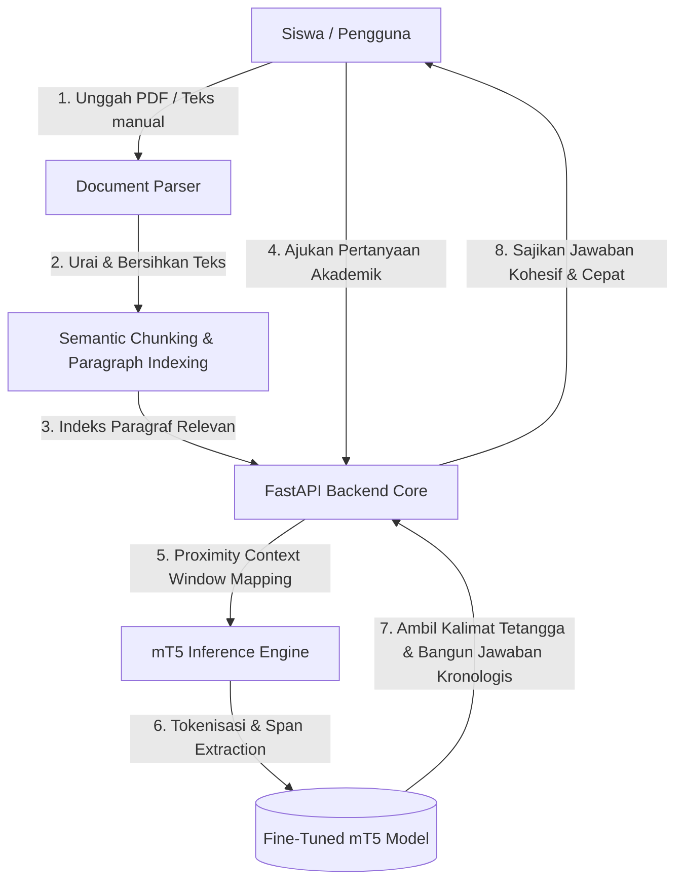

# TutorQA - Sistem Tanya Jawab Belajar Mandiri Cerdas

[](https://www.python.org/)
[](https://fastapi.tiangolo.com/)
[](https://pytorch.org/)
[](https://huggingface.co/)

TutorQA adalah platform asisten belajar mandiri virtual interaktif yang dirancang untuk membantu siswa menguasai materi pelajaran secara aktif, terarah, dan objektif. Dengan memanfaatkan kecerdasan buatan berbasis pemrosesan bahasa alami (NLP), TutorQA melayani tanya jawab langsung dari dokumen modul pelajaran PDF milik siswa sendiri tanpa mengalami masalah rekayasa fakta (halusinasi AI).

Aplikasi ini menggunakan fine-tuned model bahasa mT5-small yang dilatih secara khusus pada dataset TyDi QA (Indonesian split) untuk melakukan ekstraksi jawaban yang presisi dan wajar secara kronologis sesuai materi asli.

Developed by **Kelompok 4 — Politeknik Caltex Riau**: Baldiagus Dianpama ([baldiagus23ti@mahasiswa.pcr.ac.id](mailto:baldiagus23ti@mahasiswa.pcr.ac.id)), Ghaswul Fikri Fadhillah ([ghaswul23ti@mahasiswa.pcr.ac.id](mailto:ghaswul23ti@mahasiswa.pcr.ac.id)), and La Ode Fatahillah Muhammad ([la23ti@mahasiswa.pcr.ac.id](mailto:la23ti@mahasiswa.pcr.ac.id)).

---

## Arsitektur Sistem dan Alur Kerja

TutorQA beroperasi sebagai sistem modular terintegrasi yang memisahkan pengolahan dokumen, inferensi model NLP, dan antarmuka interaktif:



### 1. Backend Core Pipeline (app/)
* **Layout-Aware PDF Parser (app/document.py):** Menggunakan pustaka `pypdf` untuk mengekstrak isi teks per halaman secara berurutan. Karakter sampah, spasi ganda, dan pembatas baris yang rusak secara otomatis dibersihkan agar teks mengalir wajar.
* **Semantic Proximity Context Matcher (app/answer_builder.py):** Ketika siswa bertanya, sistem tidak hanya mencari kecocokan kata kunci mentah, tetapi memetakan kalimat utama di dalam teks pelajaran. Sistem mengekstrak kalimat-kalimat tetangga (`core_idx - 1` hingga `core_idx + 2`) untuk merangkai sebuah paragraf jawaban yang utuh, kronologis, dan kontekstual.
* **mT5 Inference Engine (app/inference.py):** Menjalankan ekstraksi jawaban langsung menggunakan bobot fine-tuned model mT5 yang di-host secara lokal. Model bertugas mengidentifikasi koordinat tepat (exact span) lokasi jawaban di dalam materi pelajaran.
* **Academic Question Generator (app/suggestions.py):** Menganalisis kata kunci akademis penting dari materi, menyaring kata-kata sampah pembagian kelompok, dan menyusun saran pertanyaan konseptual cerdas (seperti "Apa perbedaan konsep A dan B?") secara dinamis untuk memandu siswa belajar secara aktif.

### 2. Frontend Web Experience (static/ & templates/)
* **Editorial Glassmorphic Design System (static/css/styles.css):** Antarmuka web modern dengan tipografi artistik Plus Jakarta Sans, tata letak asimetris premium, efek kaca transparan (glassmorphism), dan skema warna biru malam (indigo) yang kontras dipadukan aksen hijau-neon (lime).
* **3D Polar Carousel Wheel (static/js/app.js):** Kolase visual 3D yang berputar lembut secara interaktif mengikuti pergerakan scroll halaman utama (sticky scroll track), memberikan impresi visual kelas atas yang dinamis.
* **Tactile 3D Cards:** Kartu profil pengembang interaktif dengan efek rotasi sumbu-Y 3D realistis yang melayang (`translateY(-6px)`) dan memproyeksikan bayangan dramatis dinamis (layered ambient drop shadows).

---

## Struktur Direktori Proyek

Proyek TutorQA telah diorganisasikan ke dalam struktur modular yang rapi demi kemudahan pemeliharaan:

```
NLP/
├── app/                       # Core Backend FastAPI
│   ├── __init__.py
│   ├── answer_builder.py      # Logika perangkaian jawaban kronologis
│   ├── document.py            # Modul ekstraksi teks PDF & chunking
│   ├── inference.py           # Kelas inferensi lokal model mT5-small
│   ├── main.py                # REST API router & static resource server
│   └── suggestions.py         # Formulasi saran kuis akademik cerdas
├── docs/                      # Dokumen proposal & panduan cetak
│   ├── Draft Proposal_Kelompok4.pdf
│   ├── PANDUAN_DEVELOPER.html # Panduan developer format HTML premium
│   └── synthesis.capital-design.md
├── notebooks/                 # Notebook pelatihan AI
│   └── ModelT5Train_NLP.ipynb # Google Colab Notebook fine-tuning mT5
├── scripts/                   # Skrip utilitas internal pengembang
│   ├── create_notebook.py
│   └── create_notebook_final.py
├── static/                    # Aset visual frontend web
│   ├── css/
│   │   └── styles.css         # Lembar gaya Editorial Glassmorphism
│   ├── js/
│   │   └── app.js             # Efek Carousel 3D & UI obrolan interaktif
│   └── ghaswul_profil.png     # Foto portrait pengembang
├── templates/                 # Tampilan UI HTML5
│   ├── belajar.html           # Panel belajar & kuis mandiri
│   ├── fitur.html             # Rincian arsitektur teknologi model
│   ├── index.html             # Halaman Beranda utama
│   └── panduan-penggunaan.html# Panduan siswa interaktif
├── mt5-qa-indonesia/          # Direktori berkas bobot fine-tuned model mT5
├── run.py                     # Bootloader aplikasi FastAPI
└── requirements.txt           # Daftar pustaka python proyek
```

---

## Langkah Instalasi dan Memulai Cepat

### 1. Kebutuhan Sistem
* Python 3.10 atau versi di atasnya.
* RAM minimal 8GB (disarankan RAM 16GB atau lebih untuk menjalankan inferensi model dengan lancar).

### 2. Pelatihan & Penyusunan Model (mT5)
Model ekstraksi jawaban menggunakan fine-tuned mT5-small yang harus diletakkan secara lokal di folder `mt5-qa-indonesia/`. Berikut langkah untuk mendapatkan berkas model tersebut:

1. **Jalankan Pelatihan di Google Colab**:
   - Buka notebook [ModelT5Train_NLP.ipynb](file:///c:/Punya%20GW/01.%20CODE/NLP/notebooks/ModelT5Train_NLP.ipynb) yang berada di direktori `notebooks/`.
   - Unggah notebook tersebut ke Google Colab dan jalankan seluruh sel untuk melatih model menggunakan dataset TyDi QA (Indonesian split).
   - Setelah proses selesai, sel terakhir pada notebook akan otomatis menghubungkan ke Google Drive Anda dan menyimpan bobot model serta tokenizer ke folder `/NLP/mt5-qa-indonesia/`.

2. **Unduh Berkas Model**:
   - Unduh folder `mt5-qa-indonesia` dari Google Drive Anda.
   - Pindahkan folder tersebut ke direktori utama (root) proyek ini sehingga strukturnya seperti berikut:
     ```text
     NLP/
     ├── mt5-qa-indonesia/
     │   ├── config.json
     │   ├── generation_config.json
     │   ├── model.safetensors
     │   ├── spiece.model
     │   ├── special_tokens_map.json
     │   └── tokenizer_config.json
     ```

### 3. Pemasangan Pustaka Dependensi
Buka shell terminal Anda, arahkan ke direktori proyek, dan jalankan perintah berikut untuk menginstal seluruh pustaka Python yang diperlukan:
```bash
pip install -r requirements.txt
```

### 4. Menjalankan Aplikasi
Jalankan script bootloader di root direktori untuk meluncurkan server FastAPI (Uvicorn) secara lokal:
```bash
python run.py
```
Setelah server berhasil dijalankan, buka peramban web dan akses aplikasi pada alamat:
[http://localhost:8000](http://localhost:8000)

---

## Dokumentasi REST API Endpoints

FastAPI menyediakan rute antarmuka backend berbasis JSON untuk mengelola materi dan menjawab pertanyaan pelajaran:

### 1. Unggah Dokumen PDF
* **Endpoint:** `/api/upload`
* **Metode:** `POST`
* **Tipe Konten:** `multipart/form-data`
* **Parameter:** `file` (Berkas PDF pelajaran)
* **Response Contoh (200 OK):**
  ```json
  {
    "document_id": "c7a8b9f0-1234-5678-abcd-ef0123456789",
    "filename": "Bab_2_Neural_Networks.pdf",
    "char_count": 28450,
    "suggestions": [
      "Apa yang dimaksud dengan backpropagation menurut materi?",
      "Bagaimana cara kerja activation function yang dijelaskan?",
      "Apa fungsi utama dari loss function pada neural networks?"
    ]
  }
  ```

### 2. Tanya Jawab Cerdas (Inference)
* **Endpoint:** `/api/ask`
* **Metode:** `POST`
* **Tipe Konten:** `application/json`
* **Payload Request:**
  ```json
  {
    "question": "Bagaimana cara kerja backpropagation?",
    "document_id": "c7a8b9f0-1234-5678-abcd-ef0123456789",
    "mode": "mendalam"
  }
  ```
  *(Opsi mode: `mendalam` untuk penjelasan detail, `ringkas` untuk rangkuman kilat, atau `langkah` untuk penjabaran prosedural).*
* **Response Contoh (200 OK):**
  ```json
  {
    "answer": "Cara kerja backpropagation didasarkan pada perhitungan gradien fungsi kerugian untuk setiap bobot jaringan. Gradien ini dihitung mundur dari lapisan keluaran ke lapisan masukan melalui aturan rantai kalkulus untuk memperbarui bobot secara iteratif.",
    "key_points": [
      "Perhitungan mundur gradien fungsi kerugian.",
      "Penerapan aturan rantai kalkulus.",
      "Pembaruan bobot jaringan secara iteratif."
    ],
    "context": "Backpropagation merupakan algoritma pelatihan utama pada neural networks..."
  }
  ```

### 3. Saran Pertanyaan Manual
* **Endpoint:** `/api/suggestions`
* **Metode:** `POST`
* **Tipe Konten:** `application/json`
* **Payload Request:**
  ```json
  {
    "context": "Word embedding adalah representasi kata ke dalam ruang vektor berdimensi rendah..."
  }
  ```
* **Response Contoh (200 OK):**
  ```json
  {
    "suggestions": [
      "Apa yang dimaksud dengan word embedding menurut materi?",
      "Bagaimana penerapan representasi kata yang dijelaskan?"
    ]
  }
  ```


